# Modello dati — ER + DDL PostgreSQL

> Schema relazionale per la WebApp Value Investing. PostgreSQL 16 + Spring Data JPA + Flyway migrations. Vedi [ADR-003](../decisions/ADR-003-database-postgresql.md) per la scelta dello stack.

## ER Diagram

```mermaid
erDiagram
    USERS ||--o{ WATCHLISTS : owns
    USERS ||--o{ REFRESH_TOKENS : has
    USERS ||--o{ MOAT_CHECKLIST_ENTRY : authors
    USERS ||--o{ DCF_METHOD_OVERRIDE : sets

    WATCHLISTS ||--o{ WATCHLIST_ITEMS : contains

    STOCKS ||--o{ FMP_FINANCIAL_SNAPSHOT : snapshots
    STOCKS ||--o{ FMP_PROFILE_SNAPSHOT : profiles
    STOCKS ||--o{ RULE_ENGINE_RESULT : evaluated
    STOCKS ||--o{ MOAT_CHECKLIST_ENTRY : described
    STOCKS ||--o{ WATCHLIST_ITEMS : referenced
    STOCKS ||--o{ DCF_METHOD_OVERRIDE : targeted
    STOCKS ||--o{ FMP_API_EVENT_LOG : involves

    USERS {
        uuid id PK
        varchar email UK
        varchar password_hash
        varchar display_name
        timestamptz created_at
        timestamptz last_login_at
    }

    REFRESH_TOKENS {
        uuid id PK
        uuid user_id FK
        varchar token_value UK
        timestamptz expires_at
        timestamptz revoked_at
        timestamptz first_issued_at "ADR-010 sliding+cap; ADR-027 family identifier per cascade revocation"
    }

    WATCHLISTS {
        uuid id PK
        uuid user_id FK
        varchar name
        boolean is_default
        timestamptz created_at
    }

    WATCHLIST_ITEMS {
        uuid id PK
        uuid watchlist_id FK
        varchar ticker FK
        timestamptz added_at
    }

    STOCKS {
        varchar ticker PK
        varchar company_name
        varchar sector
        varchar industry
        numeric market_cap_usd
        timestamptz last_refreshed_at
    }

    FMP_FINANCIAL_SNAPSHOT {
        uuid id PK
        varchar ticker FK
        varchar endpoint
        jsonb payload
        timestamptz fetched_at
        boolean is_stale
        text stale_reason
    }

    FMP_PROFILE_SNAPSHOT {
        uuid id PK
        varchar ticker FK
        numeric price
        numeric market_cap
        varchar sector
        varchar industry
        jsonb raw_payload
        timestamptz fetched_at
    }

    RULE_ENGINE_RESULT {
        uuid id PK
        varchar ticker FK
        timestamptz evaluated_at
        jsonb signals "ADR-028 typed oneOf/discriminator su ruleId; ADR-029 estende a 15 ruleId (+NCAV_LATEST, +NET_NET_RATIO)"
        numeric graham_number
        numeric dcf_intrinsic_value
        varchar dcf_method
        varchar mos_signal
        numeric current_price_at_eval
        timestamptz source_snapshot_fetched_at
    }

    MOAT_CHECKLIST_ENTRY {
        uuid id PK
        uuid user_id FK
        varchar ticker FK
        varchar moat_type
        varchar status
        text note
        timestamptz updated_at
    }

    DCF_METHOD_OVERRIDE {
        uuid id PK
        uuid user_id FK
        varchar ticker FK
        varchar forced_method
        timestamptz created_at
    }

    FMP_API_EVENT_LOG {
        bigserial id PK
        timestamptz occurred_at
        varchar event_type
        varchar ticker FK
        varchar endpoint
        int http_status
        text detail
    }
```



## Specifiche tabelle

### `users` (EP-006, US-017)

Identita' utente per autenticazione (vedi [ADR-006](../decisions/ADR-006-authentication.md)).

| Colonna | Tipo | Vincoli | Note |
|---|---|---|---|
| `id` | UUID | PK, default `gen_random_uuid()` | |
| `email` | VARCHAR(255) | UNIQUE NOT NULL | lowercase, indice unique |
| `password_hash` | VARCHAR(72) | NOT NULL | BCrypt cost 12 |
| `display_name` | VARCHAR(120) | NULL | nome esposto in UI |
| `created_at` | TIMESTAMPTZ | NOT NULL DEFAULT now() | |
| `last_login_at` | TIMESTAMPTZ | NULL | |

Indice: `UNIQUE (lower(email))`.

### `refresh_tokens`

| Colonna | Tipo | Vincoli |
|---|---|---|
| `id` | UUID PK | |
| `user_id` | UUID NOT NULL | FK -> users(id) ON DELETE CASCADE |
| `token_value` | VARCHAR(128) | UNIQUE NOT NULL |
| `expires_at` | TIMESTAMPTZ NOT NULL | |
| `revoked_at` | TIMESTAMPTZ NULL | |

Indice: `(user_id, revoked_at)`.

### `watchlists` (US-017)

| Colonna | Tipo | Vincoli |
|---|---|---|
| `id` | UUID PK | |
| `user_id` | UUID NOT NULL | FK -> users(id) ON DELETE CASCADE |
| `name` | VARCHAR(120) NOT NULL | default `"My Watchlist"` |
| `is_default` | BOOLEAN NOT NULL DEFAULT true | |
| `created_at` | TIMESTAMPTZ NOT NULL DEFAULT now() | |

Vincolo: al massimo una `is_default=true` per utente (partial unique index).

### `watchlist_items` (US-017)

| Colonna | Tipo | Vincoli |
|---|---|---|
| `id` | UUID PK | |
| `watchlist_id` | UUID NOT NULL | FK -> watchlists(id) ON DELETE CASCADE |
| `ticker` | VARCHAR(10) NOT NULL | FK -> stocks(ticker) |
| `added_at` | TIMESTAMPTZ NOT NULL DEFAULT now() | |

Vincolo unique: `(watchlist_id, ticker)`.

### `stocks`

Catalogo titoli noti (popolato lazy alla prima ricerca). Sorgente: FMP profile/search.

| Colonna | Tipo | Vincoli |
|---|---|---|
| `ticker` | VARCHAR(10) PK | uppercase |
| `company_name` | VARCHAR(255) | |
| `sector` | VARCHAR(80) | settori GICS (vedi [[vi-07-risoluzione-q002-q003]]) |
| `industry` | VARCHAR(120) | |
| `market_cap_usd` | NUMERIC(20,2) | |
| `last_refreshed_at` | TIMESTAMPTZ | quando `stocks` row e' stata aggiornata da FMP |

Indice: `(sector)`, `(market_cap_usd)` per screener (US-002).

### `fmp_financial_snapshot` (US-004, US-005, US-006)

Cache JSONB delle 4 chiamate FMP "pesanti".

| Colonna | Tipo | Vincoli |
|---|---|---|
| `id` | UUID PK | |
| `ticker` | VARCHAR(10) NOT NULL | FK -> stocks(ticker) |
| `endpoint` | VARCHAR(40) NOT NULL | `income-statement` \| `balance-sheet-statement` \| `cash-flow-statement` \| `key-metrics` |
| `payload` | JSONB NOT NULL | array di periodi (fino a 10) |
| `fetched_at` | TIMESTAMPTZ NOT NULL | usato per TTL 24h |
| `is_stale` | BOOLEAN NOT NULL DEFAULT false | settato true quando servito come fallback |
| `stale_reason` | TEXT NULL | |

Indice: `(ticker, endpoint, fetched_at DESC)` per lookup ultima versione.

### `fmp_profile_snapshot` (US-001, US-013)

Cache prezzo corrente + meta profilo. TTL piu' breve (proposta: 1h) per riflettere price more-frequently.

| Colonna | Tipo | Vincoli |
|---|---|---|
| `id` | UUID PK | |
| `ticker` | VARCHAR(10) NOT NULL | FK -> stocks(ticker) |
| `price` | NUMERIC(18,4) | |
| `market_cap` | NUMERIC(20,2) | |
| `sector` | VARCHAR(80) | |
| `industry` | VARCHAR(120) | |
| `raw_payload` | JSONB | profilo FMP completo |
| `fetched_at` | TIMESTAMPTZ NOT NULL | |

Indice: `(ticker, fetched_at DESC)`.

### `rule_engine_result` (EP-003, EP-004, US-014)

Verdetto Rule Engine per (ticker, momento di valutazione). Vedi [ADR-005](../decisions/ADR-005-rule-engine-design.md).

| Colonna | Tipo | Vincoli |
|---|---|---|
| `id` | UUID PK | |
| `ticker` | VARCHAR(10) NOT NULL | FK -> stocks(ticker) |
| `evaluated_at` | TIMESTAMPTZ NOT NULL DEFAULT now() | |
| `signals` | JSONB NOT NULL | array `[{ruleId, signal, observedValue, threshold, rationale}]` |
| `graham_number` | NUMERIC(18,4) NULL | NULL se Not Applicable |
| `dcf_intrinsic_value` | NUMERIC(18,4) NULL | NULL se Insufficient Data |
| `dcf_method` | VARCHAR(32) NULL | `GREENWALD` \| `FCF_FALLBACK` \| `NOT_APPLICABLE` |
| `mos_signal` | VARCHAR(32) | `GREEN` \| `YELLOW` \| `RED` \| `NOT_CALCULABLE` |
| `current_price_at_eval` | NUMERIC(18,4) | |
| `source_snapshot_fetched_at` | TIMESTAMPTZ | tracciabilita' freschezza (US-005 AC) |

Indice: `(ticker, evaluated_at DESC)`.

### `moat_checklist_entry` (US-016)

Una riga per `(user, ticker, moat_type)`.

| Colonna | Tipo | Vincoli |
|---|---|---|
| `id` | UUID PK | |
| `user_id` | UUID NOT NULL | FK -> users(id) ON DELETE CASCADE |
| `ticker` | VARCHAR(10) NOT NULL | FK -> stocks(ticker) |
| `moat_type` | VARCHAR(40) NOT NULL | `INTANGIBLE_ASSETS` \| `SWITCHING_COSTS` \| `NETWORK_EFFECT` \| `COST_ADVANTAGE` |
| `status` | VARCHAR(20) NOT NULL | `PRESENT` \| `PARTIAL` \| `ABSENT` |
| `note` | TEXT NULL | annotazione libera utente |
| `updated_at` | TIMESTAMPTZ NOT NULL DEFAULT now() | |

Vincolo unique: `(user_id, ticker, moat_type)`.

### `dcf_method_override` (US-012)

Override per forzare il metodo DCF (Greenwald vs FCF) per `(user, ticker)`. Vedi [[vi-08-risoluzione-q001-owner-earnings]] §Implementazione Pratica.

| Colonna | Tipo | Vincoli |
|---|---|---|
| `id` | UUID PK | |
| `user_id` | UUID NOT NULL | FK -> users(id) ON DELETE CASCADE |
| `ticker` | VARCHAR(10) NOT NULL | FK -> stocks(ticker) |
| `forced_method` | VARCHAR(32) NOT NULL | `GREENWALD` \| `FCF_FALLBACK` |
| `created_at` | TIMESTAMPTZ NOT NULL DEFAULT now() | |

Vincolo unique: `(user_id, ticker)`.

### `fmp_api_event_log` (US-006, ADR-008)

Log eventi notevoli del provider esterno (ridondante rispetto a logging Logback, conserva history breve).

| Colonna | Tipo | Vincoli |
|---|---|---|
| `id` | BIGSERIAL PK | |
| `occurred_at` | TIMESTAMPTZ NOT NULL DEFAULT now() | |
| `event_type` | VARCHAR(40) NOT NULL | `FMP_429_RATE_LIMITED` \| `FMP_5XX` \| `FMP_CIRCUIT_OPEN` \| `FMP_FALLBACK_STALE` \| `FMP_TICKER_NOT_FOUND` |
| `ticker` | VARCHAR(10) NULL | FK -> stocks(ticker) opzionale |
| `endpoint` | VARCHAR(40) NULL | |
| `http_status` | INT NULL | |
| `detail` | TEXT NULL | |

Indice: `(event_type, occurred_at DESC)`. Retention: 30 giorni (procedura housekeeping notturna; out of MVP).

## Vincoli cross-tabella

- ON DELETE CASCADE da `users` per: `refresh_tokens`, `watchlists`, `moat_checklist_entry`, `dcf_method_override`.
- ON DELETE CASCADE da `watchlists` per `watchlist_items`.
- Nessun ON DELETE su `stocks` (immutabile dopo creazione; rimozioni di massa non previste).

## Migrations (Flyway)

```
src/backend/src/main/resources/db/migration/
 ├── V001__create_users_and_auth.sql
 ├── V002__create_stocks.sql
 ├── V003__create_fmp_cache.sql
 ├── V004__create_rule_engine_result.sql
 ├── V005__create_watchlists.sql
 ├── V006__create_moat_checklist.sql
 ├── V007__create_dcf_overrides.sql
 └── V008__create_fmp_event_log.sql
```

DDL completo: [schema.sql](schema.sql).

## Pagine collegate

- [[webapp-architecture-vi]]
- [[value-investing-rule-engine]]
- [ADR-003](../decisions/ADR-003-database-postgresql.md)
- [ADR-004](../decisions/ADR-004-fmp-integration.md)
- [ADR-005](../decisions/ADR-005-rule-engine-design.md)
- [ADR-006](../decisions/ADR-006-authentication.md)
- [overview.md](../overview.md)
