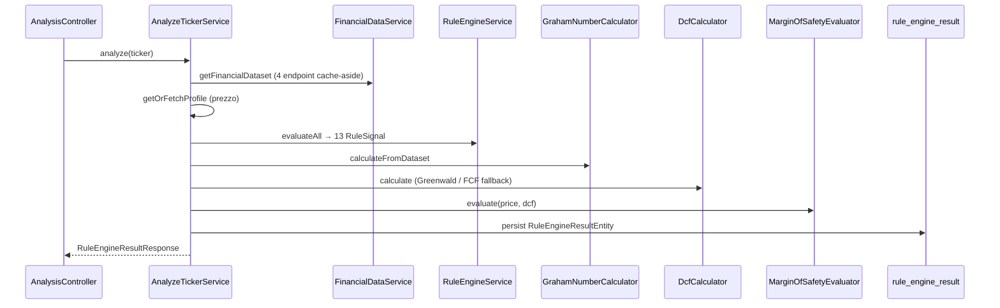
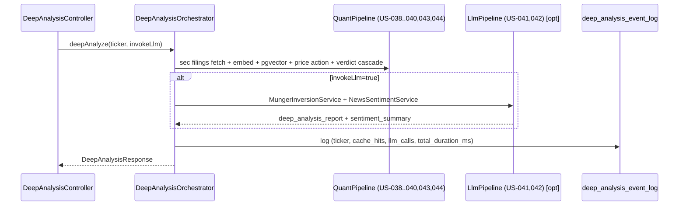

# Pipeline API di analisi (`GET /api/analysis/{ticker}`)

> Endpoint unificato che orchestra acquisizione dati FMP (con cache), valutazione delle 13 regole quantitative (7 Buffett + 6 Graham), Graham Number, DCF e Margin of Safety, con persistenza del risultato.

## Contesto

Sprint 2 (EP-003 + EP-004) espone il verdetto completo del [[value-investing-rule-engine]] tramite un singolo endpoint REST documentato in `design_&_architecture/api/openapi.yaml` §`/api/analysis/{ticker}`. [^src: design_&_architecture/api/openapi.yaml §/api/analysis/{ticker}]

Il frontend Traffic Light (US-014, TSK-021) consumerà questo contratto; fino al bootstrap Next.js (TSK-030) il payload è verificabile via test di integrazione e OpenAPI. [^src: management/kanban/EP-005-dashboard-traffic-light-moat/US-014-pannello-traffic-light/US-014.md §Descrizione]

## Flusso runtime

Implementazione: `src/backend/.../service/AnalyzeTickerService.kt`, `api/AnalysisController.kt`. [^src: design_&_architecture/components/backend-components.md §AnalyzeTickerService]

## Contratto HTTP

| Elemento | Valore |
|----------|--------|
| Metodo / path | `GET /api/analysis/{ticker}` |
| Header risposta | `X-Data-Snapshot-At`, `X-Data-Stale`, `Cache-Control: no-store` |
| Body | `RuleEngineResult` (OpenAPI): `ticker`, `evaluatedAt`, `signals[13]`, `grahamNumber`, `dcfIntrinsicValue`, `dcfMethod`, `mosSignal`, `currentPriceAtEval`, `dataSnapshotAt`, `isStale` |
| Errori | `404` ticker non trovato; `503` FMP down senza cache (RFC 9457 ProblemDetails) |

## Tredici regole (`signals`)

Ogni voce è un `RuleSignal` con `ruleId`, `signal` (`GREEN` \| `YELLOW` \| `RED` \| `INDETERMINATE` \| `NOT_CALCULABLE`), `observedValue`, `threshold`, `rationale`. Ordinamento deterministico per `ruleId`.

| ruleId | US | Note implementative |
|--------|-----|---------------------|
| `ROE_10Y_AVG` | US-007 | Media 10y; &lt; 5 anni → `INDETERMINATE` |
| `ROIC_10Y_AVG` | US-007 | Idem ROE |
| `GROSS_MARGIN_10Y_AVG` | US-008 | Soglie 40% / 30–40% / &lt;30% |
| `NET_MARGIN_10Y_AVG` | US-008 | Binario: &gt;10% GREEN, altrimenti RED |
| `CURRENT_RATIO_LATEST` | US-009 | Ultimo esercizio; soglia 2.0 / 1.5–2.0 |
| `DEBT_TO_INCOME_LATEST` | US-009 | Debito LT / utile; netIncome ≤ 0 → `INDETERMINATE` |
| `CAPEX_INTENSITY_10Y_AVG` | US-010 | \|CapEx\| / net income; media 10y o fallback latest |

## Valutazione (EP-004)

- **Graham Number:** `GrahamNumberCalculator` — `sqrt(22.5 × EPS × BVPS)`; non applicabile se input ≤ 0.
- **DCF:** `DcfCalculator` — Greenwald (PPE/Revenue) primario; fallback FCF se Greenwald non usable; growth cap 5–7%, discount 9.5%, terminal 2.5%, 10 anni proiezione. [^src: design_&_architecture/decisions/ADR-005-rule-engine-design.md]
- **Override metodo DCF:** `POST/DELETE /api/dcf-overrides` (header stub `X-User-Id` fino a JWT TSK-033).
- **Margin of Safety:** `mosSignal` GREEN se `prezzo < 0.70 × dcfIntrinsicValue`; `NOT_CALCULABLE` se DCF o prezzo assenti (&lt; 5 anni FCF/Owner Earnings).

## Persistenza e cache

- Ogni analisi scrive una riga in `rule_engine_result` (`signals` JSONB, `graham_number`, `dcf_intrinsic_value`, `mos_signal`, `source_snapshot_fetched_at`).
- Cache FMP 24h (`fmp_financial_snapshot`); fallback stale su `FmpUnavailableException` marca `isStale=true` (US-006). [^src: design_&_architecture/decisions/ADR-004-fmp-integration.md §Fallback su cache scaduta]

## Aggiornamenti (v2026-05-25) — Endpoint `/api/analysis/{ticker}/deep`

EP-011 estende la pipeline con un secondo endpoint orchestratore che incorpora la deep analysis narrativa (RAG 10-K/10-Q + LLM Munger inversion) oltre ai segnali quantitativi. [^src: management/kanban/EP-011-deep-analysis-10k-10q/US-045-endpoint-deep-analysis/US-045.md §Descrizione]

### Contratto HTTP `/deep`

| Elemento | Valore |
|----------|--------|
| Metodo / path | `GET /api/analysis/{ticker}/deep` |
| Query param | `invoke_llm` (`true` \| `false`, default `false`) |
| Policy LLM | Campi deterministici sempre presenti; campi LLM-dipendenti (`deep_analysis_report`, `sentiment_summary`) popolati **solo se `invoke_llm=true`** |
| Errori | `404` ticker non risolvibile; `422` con `reason="no_sec_filings"` se nessun filing SEC; `503` con `reason="llm_unavailable"` o `"LLM_FROZEN_BY_ADMIN"` (RFC 9457) |

[^src: management/kanban/EP-011-deep-analysis-10k-10q/US-045-endpoint-deep-analysis/US-045.md §Business Rules]

### Payload risposta `DeepAnalysisResponse`

| Campo | Tipo | Condizione di presenza | Fonte |
|-------|------|----------------------|-------|
| `ticker` | `String` | Sempre | — |
| `generated_at` | `Instant` | Sempre | — |
| `verdict_payload` | oggetto (US-044) | Sempre (`partial_basis=true` se LLM non invocato) | [[value-investing-rule-engine]] cascade routing |
| `rule_engine_results` | `List<RuleSignal>` (13 ruleId) | Sempre | EP-010 + EP-003 |
| `price_action_snapshot` | oggetto (US-043) | Sempre | FMP `/stable/historical-price-eod/full` 12 mesi |
| `deep_analysis_report` | `String` (testo Markdown) | Solo se `invoke_llm=true` | US-041 — Munger inversion LLM (Claude Opus, default `claude-opus-4-8`, configurabile via `ANTHROPIC_MODEL`) |
| `sentiment_summary` | oggetto (US-042) | Solo se `invoke_llm=true` | US-042 — classificazione news (`TEMPORARY_PANIC` \| `STRUCTURAL_DAMAGE` \| `NEUTRAL`) |
| `filings_used` | `List<FilingRef>` (id, form, filed_at) | Sempre (vuoto se no filing) | US-039 — filing_blob |
| `llm_status` | `String` enum | Sempre | `"INVOKED"` \| `"NOT_INVOKED"` \| `"CACHE_HIT"` \| `"BUDGET_FROZEN"` |
| `llm_cost_estimate_usd` | `Double?` | Sempre | Stima a priori per decisione client |

[^src: management/kanban/EP-011-deep-analysis-10k-10q/US-045-endpoint-deep-analysis/US-045.md §Business Rules]

### Flusso orchestrazione `/deep`

### Finestre di cache e latenze attese

| Componente | TTL cache | Latenza attesa (cache hit) |
|------------|-----------|---------------------------|
| Filing blob (10-K/10-Q) | 90gg | — |
| Report Munger LLM | 90gg | < 2s (cache hit) |
| News sentiment | 24h | < 2s (cache hit) |
| Price action snapshot | 24h | < 2s (cache hit) |
| Prima esecuzione cold (con LLM) | — | 30–90s |

[^src: management/kanban/EP-011-deep-analysis-10k-10q/US-045-endpoint-deep-analysis/US-045.md §Business Rules]

### Audit log

Ogni esecuzione logga in `deep_analysis_event_log`: `(ticker, generated_at, cache_hits, llm_calls, total_duration_ms)`. [^src: management/kanban/EP-011-deep-analysis-10k-10q/US-045-endpoint-deep-analysis/US-045.md §Business Rules]

## Aggiornamenti (v2026-05-30) — Deep analysis ASINCRONA + split INGEST/ANALYSIS

La deep analysis è passata da sincrona (`GET .../deep`, che resta disponibile per usi semplici) a un modello **asincrono** con execution persistita, e poi è stata **separata in due operazioni distinte** (INGEST vs ANALYSIS) per disaccoppiare il costo di indicizzazione dal verdetto. Le due migration coinvolte sono `V027__deep_analysis_run.sql` (tabella run + result cache) e `V028__deep_analysis_run_kind.sql` (colonna discriminante `kind`). [^src: src/backend/src/main/resources/db/migration/V027__deep_analysis_run.sql] [^src: src/backend/src/main/resources/db/migration/V028__deep_analysis_run_kind.sql]

### Modello asincrono (V027 — `deep_analysis_run`)

I POST tornano **202 Accepted** con `run-id` + `status` e lavorano in background; il client polla i rispettivi endpoint `latest`. Una sola riga per run nella tabella `deep_analysis_run`; il risultato (serializzato `DeepAnalysisResponse`) è persistito in `result_json` solo su `SUCCESS`. Stati: `RUNNING → SUCCESS | FAILED`. Dedup: se esiste già una run dello stesso `kind` in stato `RUNNING` per il ticker, l'enqueue ritorna quella invece di crearne una nuova. `error_reason` allineato alle reason di `GlobalExceptionHandler`: `not_found | no_sec_filings | llm_unavailable | embedding_unavailable | internal_error`. Indici su `(ticker, requested_at DESC)`, `(ticker, status)`, `(ticker, kind, requested_at DESC)`. [^src: src/backend/src/main/resources/db/migration/V027__deep_analysis_run.sql]

### Split INGEST vs ANALYSIS (V028 — colonna `kind`)

| `kind` | Cosa fa | Embedding | Costo LLM |
|--------|---------|-----------|-----------|
| `INGEST` | Scarica i filing 10-K/10-Q e **calcola/salva gli embedding** via `FilingRagService`. **Idempotente**: salta i filing già indicizzati. | Produce e persiste | nessuno |
| `ANALYSIS` | Verdetto **deterministico** (rule engine + cascade, NESSUN embedding) oppure, con `invoke_llm=true`, lo step LLM Munger inversion che **RIUSA** gli embedding già persistiti da un INGEST precedente. | Solo consuma (ramo LLM) | solo se `invoke_llm=true` |

Punto chiave: **gli embedding servono SOLO al ramo LLM**. L'ANALYSIS senza LLM produce comunque un verdetto senza toccare pgvector. Se si richiede l'ANALYSIS-con-LLM senza aver prima indicizzato, la pipeline ritorna l'errore guidato `not_indexed` — **niente auto-ingest** (l'indicizzazione è un'azione esplicita dell'utente). Backfill V028: le righe pre-split sono marcate `ANALYSIS` (default) così le query `GET /latest` continuano a combaciare. [^src: src/backend/src/main/resources/db/migration/V028__deep_analysis_run_kind.sql]

### Endpoint async (`DeepAnalysisController`)

| Metodo / path | Esito | Note |
|---|---|---|
| `POST /api/analysis/{ticker}/deep/ingest` | 202 | Enqueue INGEST (download + embedding). Da chiamare PRIMA di un ANALYSIS-con-LLM. |
| `GET /api/analysis/{ticker}/deep/ingest/latest` | 200 | Stato ultima INGEST + summary (filings/chunks/skipped) su SUCCESS. |
| `POST /api/analysis/{ticker}/deep/runs?invoke_llm=` | 202 | Enqueue ANALYSIS (deterministica o +LLM). NON scarica/indicizza filing. |
| `GET /api/analysis/{ticker}/deep/latest` | 200 | Ultima run ANALYSIS persistita; `status=NONE` se assente. Le run INGEST sono filtrate fuori. |
| `GET /api/analysis/{ticker}/deep` | 200 | Variante sincrona originale (invariata). |

Tutti gli endpoint impostano `Cache-Control: no-store`. La UI espone 3 azioni distinte mappate su questi endpoint: **Indicizza filing** (INGEST), **Analizza** (ANALYSIS deterministica), **Analizza + LLM** (ANALYSIS `invoke_llm=true`). [^src: src/backend/src/main/kotlin/com/valueinvesting/webapp/api/DeepAnalysisController.kt]

---

## QA collegata

- Test E2E: `AnalysisControllerIT` (Testcontainers + mock FMP, 6 scenari). [^src: src/backend/src/test/kotlin/com/valueinvesting/webapp/api/AnalysisControllerIT.kt]
- Contract: `OpenApiContractIT` confronta YAML canonico vs schema runtime da **MockMvc** `GET /api/openapi.json` (CI `contract-check` green su `master`). [^src: src/backend/src/test/kotlin/com/valueinvesting/webapp/contract/OpenApiContractIT.kt]
- Vedi [[openapi-contract-check]] per springdoc 2.8.16 e anti-pattern `OpenAPIService.build()`.

## Aggiornamenti (v2026-05-21)

Verifica coerenza L5 su `master`: `AnalyzeTickerService` orchestra 13 `RuleSignal` (7 Buffett + 6 Graham) + Graham + DCF + MoS + persistenza `rule_engine_result`; EP-010 ha aggiunto le 6 regole Graham defensive. Allowlist contract in `OpenApiContractSupport.IMPLEMENTED_OPERATIONS` include solo `GET /api/analysis/{ticker}` tra gli endpoint di analisi (financials e dcf-overrides separati). [^src: src/backend/src/test/kotlin/com/valueinvesting/webapp/contract/OpenApiContractSupport.kt §IMPLEMENTED_OPERATIONS]

## Concetti correlati

[[value-investing-rule-engine]]
[[margin-of-safety]]
[[graham-number]]
[[intrinsic-value]]
[[openapi-contract-check]]
[[fmp-financial-statements-stable]]
[[pgvector-vector-store]]
[[arctic-embed-l-v2]]
[[munger-inversion-rag]]
[[panic-buy-vs-value-trap-detection]]

## Pagine collegate

[[webapp-value-investing-spec]]
[[value-investing-rule-engine-runbook]]
[[webapp-architecture-vi]]
[[value-investor-bot-architecture]]

## Storie collegate
<!-- Sezione gestita dal product-manager — non modificare se sei wiki-keeper -->
- EP-004 (R1.0 done): US-011…013, US-020 — pipeline analisi e override DCF
- EP-007 (R1.1): US-021 — conformità formato errori API (RFC 9457 extensions top-level)
- [EP-024](../../management/kanban/EP-024-riepilogo-e-technical-analysis-tab/EP-024.md) — Estende la pipeline con due nuovi endpoint: `GET /api/analysis/{ticker}/technical` (US-098) e `GET /api/analysis/{ticker}/summary` (US-103, aggregatore cross-dominio VI+Deep+TA con gate VI hardcoded)
