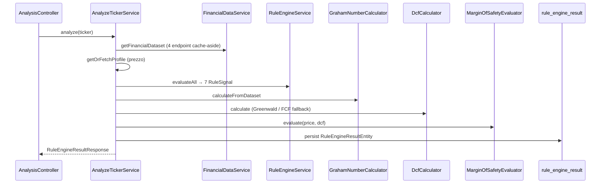

# Pipeline API di analisi (`GET /api/analysis/{ticker}`)

> Endpoint unificato che orchestra acquisizione dati FMP (con cache), valutazione delle 7 regole quantitative, Graham Number, DCF e Margin of Safety, con persistenza del risultato.

## Contesto

Sprint 2 (EP-003 + EP-004) espone il verdetto completo del [[value-investing-rule-engine]] tramite un singolo endpoint REST documentato in `design_&_architecture/api/openapi.yaml` §`/api/analysis/{ticker}`. [^src: design_&_architecture/api/openapi.yaml §/api/analysis/{ticker}]

Il frontend Traffic Light (US-014, TSK-021) consumerà questo contratto; fino al bootstrap Next.js (TSK-030) il payload è verificabile via test di integrazione e OpenAPI. [^src: management/kanban/EP-005-dashboard-traffic-light-moat/US-014-pannello-traffic-light/US-014.md §Descrizione]

## Flusso runtime

Implementazione: `src/backend/.../service/AnalyzeTickerService.kt`, `api/AnalysisController.kt`. [^src: design_&_architecture/components/backend-components.md §AnalyzeTickerService]

## Contratto HTTP

| Elemento | Valore |
|----------|--------|
| Metodo / path | `GET /api/analysis/{ticker}` |
| Header risposta | `X-Data-Snapshot-At`, `X-Data-Stale`, `Cache-Control: no-store` |
| Body | `RuleEngineResult` (OpenAPI): `ticker`, `evaluatedAt`, `signals[7]`, `grahamNumber`, `dcfIntrinsicValue`, `dcfMethod`, `mosSignal`, `currentPriceAtEval`, `dataSnapshotAt`, `isStale` |
| Errori | `404` ticker non trovato; `503` FMP down senza cache (RFC 9457 ProblemDetails) |

## Sette regole (`signals`)

Ogni voce è un `RuleSignal` con `ruleId`, `signal` (`GREEN` \| `YELLOW` \| `RED` \| `INDETERMINATE` \| `NOT_CALCULABLE`), `observedValue`, `threshold`, `rationale`. Ordinamento deterministico per `ruleId`.

| ruleId | US | Note implementative |
|--------|-----|---------------------|
| `ROE_10Y_AVG` | US-007 | Media 10y; &lt; 5 anni → `INDETERMINATE` |
| `ROIC_10Y_AVG` | US-007 | Idem ROE |
| `GROSS_MARGIN_10Y_AVG` | US-008 | Soglie 40% / 30–40% / &lt;30% |
| `NET_MARGIN_10Y_AVG` | US-008 | Binario: &gt;10% GREEN, altrimenti RED |
| `CURRENT_RATIO_LATEST` | US-009 | Ultimo esercizio; soglia 2.0 / 1.5–2.0 |
| `DEBT_TO_INCOME_LATEST` | US-009 | Debito LT / utile; netIncome ≤ 0 → `INDETERMINATE` |
| `CAPEX_INTENSITY_10Y_AVG` | US-010 | \|CapEx\| / net income; media 10y o fallback latest |

## Valutazione (EP-004)

- **Graham Number:** `GrahamNumberCalculator` — `sqrt(22.5 × EPS × BVPS)`; non applicabile se input ≤ 0.
- **DCF:** `DcfCalculator` — Greenwald (PPE/Revenue) primario; fallback FCF se Greenwald non usable; growth cap 5–7%, discount 9.5%, terminal 2.5%, 10 anni proiezione. [^src: design_&_architecture/decisions/ADR-005-rule-engine-design.md]
- **Override metodo DCF:** `POST/DELETE /api/dcf-overrides` (header stub `X-User-Id` fino a JWT TSK-033).
- **Margin of Safety:** `mosSignal` GREEN se `prezzo < 0.70 × dcfIntrinsicValue`; `NOT_CALCULABLE` se DCF o prezzo assenti (&lt; 5 anni FCF/Owner Earnings).

## Persistenza e cache

- Ogni analisi scrive una riga in `rule_engine_result` (`signals` JSONB, `graham_number`, `dcf_intrinsic_value`, `mos_signal`, `source_snapshot_fetched_at`).
- Cache FMP 24h (`fmp_financial_snapshot`); fallback stale su `FmpUnavailableException` marca `isStale=true` (US-006). [^src: design_&_architecture/decisions/ADR-004-fmp-integration.md §Fallback su cache scaduta]

## QA collegata

- Test E2E: `AnalysisControllerIT` (Testcontainers + mock FMP, 6 scenari). [^src: src/backend/src/test/kotlin/com/valueinvesting/webapp/api/AnalysisControllerIT.kt]
- Contract: `OpenApiContractIT` confronta YAML canonico vs schema runtime da **MockMvc** `GET /api/openapi.json` (CI `contract-check` green su `master`). [^src: src/backend/src/test/kotlin/com/valueinvesting/webapp/contract/OpenApiContractIT.kt]
- Vedi [[openapi-contract-check]] per springdoc 2.8.16 e anti-pattern `OpenAPIService.build()`.

## Aggiornamenti (v2026-05-21)

Verifica coerenza L5 su `master`: `AnalyzeTickerService` orchestra ancora 7 `RuleSignal` + Graham + DCF + MoS + persistenza `rule_engine_result`; nessuna modifica al contratto path rispetto a Sprint 2. Allowlist contract in `OpenApiContractSupport.IMPLEMENTED_OPERATIONS` include solo `GET /api/analysis/{ticker}` tra gli endpoint di analisi (financials e dcf-overrides separati). [^src: src/backend/src/test/kotlin/com/valueinvesting/webapp/contract/OpenApiContractSupport.kt §IMPLEMENTED_OPERATIONS]

## Concetti correlati

[[value-investing-rule-engine]]
[[margin-of-safety]]
[[graham-number]]
[[intrinsic-value]]
[[openapi-contract-check]]
[[fmp-financial-statements-stable]]

## Pagine collegate

[[webapp-value-investing-spec]]
[[value-investing-rule-engine-runbook]]
[[webapp-architecture-vi]]

## Storie collegate
<!-- Sezione gestita dal product-manager — non modificare se sei wiki-keeper -->
- EP-004 (R1.0 done): US-011…013, US-020 — pipeline analisi e override DCF
- EP-007 (R1.1): US-021 — conformità formato errori API (RFC 9457 extensions top-level)
